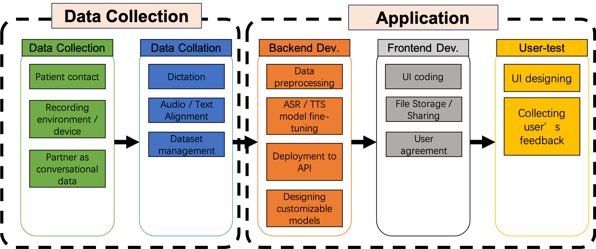

# Instruction fro Laronix AVA Data Collection
This Document is for details about how to collect high-quality, reliable AVA device data with real-world patient.
this instruction is designed to collect Parallel data from multiple speakers is desired for further experiment.

## Workflow of data collection

## Preparation before data recording
### Speakers Including criteria
- Over 6 weeks training with AVA device
- No cancer history 

### Recording Equipment and Environment

- In person / remote: Prefer in person as Laronix can monitor and giving feedback to them, remote is also acceptable.
- Recording equipment: Using a handy recorder and connect it to PC as microphone.
  - Device name: Zoom H1/H2/H5 
  - Sample rate: 48 kHz
  - Channels: mono channel (As the evaluation system only support 1 channel input)
  - Volume: 5 (on the device)

### Components of Recording Material

The dataset is organized by 2 parts, scripted data adn conversational data:

1. Scripted Data

The scripted data session includes 200 sentences collected from 5 articles. The references for both the audio and text versions of these sentences have already been uploaded or will be uploaded to the Laronix Recording system. (Ask Kevin for these files) The distribution of sentences from each article is as follows:

- Arthur the Rat: 56 sentences

- Cinder: 19 sentences

- Rainbow: 26 sentences

- Sentences: 59 sentences

- VCTK: 40 sentences

2. Conversational Data

The conversational data session focuses on natural conversations and involves the following components:

a. Q&A

In this component, a set of 50 sentences will be provided, consisting of questions and answers. During the recording, the partner will ask the questions (Q), and the patient will provide the answers (A). Both the questions and answers will be recorded.

b. Freestyle

The patients will have the freedom to talk about a given topic. They will be asked to respond with 5 to 10 sentences. The structure for this component can be referenced from the IELTS speaking test.
e.g. [IELTS topics](https://ieltsliz.com/ielts-speaking-part-1-topics/)

### Document for Laronix Recording System

The Laronix recording system is designed for data collection from potential users of the AVA Device, which works as their voice cord.

Input:

- Audio signal

- Reference ID

- Reference text

- Reference Phoneme per minute

Output:

- wav_pause_plot: Wave signal plot with pauses detected by VAD algorithm (SNR = 40dB)

- Predicted Mean Opinion Score: Score estimating data quality on the MOS scale using an ML prediction model (1-5)

- Hypotheses: Text predicted by Automatic Speech Recognition model (wav2vev2.0 + CTC)

- WER: Word Error Rate (lower is better)

- Predicted Phonemes

- PPM: Phonemes per minute

- Message: Feedback from the system

### Data Collation 

After collecting raw recordings from patient, data needs to be collated to make sure they are aligned with text and parallel.

### Final output
[Overview of Laronix database](https://kevinlaronix.notion.site/754ddf2d915142f78f150e62a1194355?v=703b8bef383749d9b0dd7b6397ab08e2)