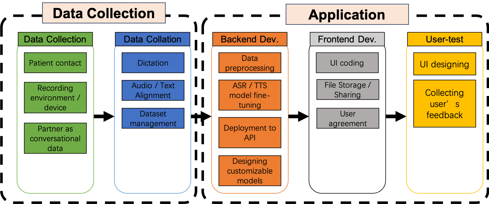
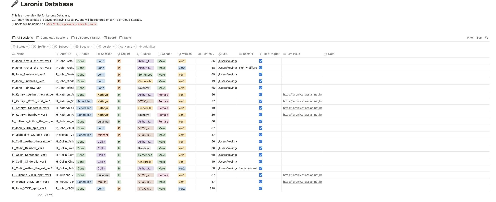

# Instruction fro Laronix AVA Data Collection
This document provides details on how to collect high-quality, reliable AVA device data with real-world patients.
These instructions are designed to collect parallel data from multiple speakers for further experimentation.

## Workflow of data collection

## Preparation before data recording
### Speakers Including criteria
- Over 6 weeks of training with AVA device
- No history of cancer

### Recording Equipment and Environment

- In person / remote: Preferably in person, as Laronix can monitor and provide feedback. Remote recording is also acceptable.
- Recording equipment: Use a handy recorder and connect it to a PC as a microphone.
  - Device name: Zoom H1/H2/H5 
  - Sample rate: 48 kHz
  - Channels: Mono channel (As the evaluation system only supports 1 channel input)
  - Volume: 5 (on the device)

### Components of Recording Material

The dataset is organized into 2 parts: scripted data and conversational data.

1. Scripted Data

The scripted data session includes 200 sentences collected from 5 articles. The references for both the audio and text versions of these sentences have already been uploaded or will be uploaded to the Laronix Recording system (Ask Kevin for these files). The distribution of sentences from each article is as follows:

- Arthur the Rat: 56 sentences

- Cinder: 19 sentences

- Rainbow: 26 sentences

- Sentences: 59 sentences

- VCTK: 40 sentences

2. Conversational Data

The conversational data session focuses on natural conversations and involves the following components:

a. Q&A

In this component, a set of 50 sentences will be provided, consisting of questions and answers. During the recording, the partner will ask the questions (Q), and the patient will provide the answers (A). Both the questions and answers will be recorded.

b. Freestyle

The patients will have the freedom to talk about a given topic. They will be asked to respond with 5 to 10 sentences. The structure for this component can be referenced from the IELTS speaking test.

e.g. [IELTS topics](https://ieltsliz.com/ielts-speaking-part-1-topics/)

### Document for Laronix Recording System
[Recording System Interface](./figs/Recording_interface.png)

The Laronix recording system is designed for data collection from potential users of the AVA Device. It can evaluate the naturalness of audio using a voice quality model named [VoiceMOS](https://voicemos-challenge-2022.github.io/) [Source Model](https://huggingface.co/spaces/sarulab-speech/UTMOS-demo), and the intelligibility is evaluated by an Automatic Speech Recognition engine (Wav2vec2.0 + CTC).

Input:

- Audio signal

- Reference ID

- Reference text

- Reference Phoneme per minute

Output:

- wav_pause_plot: Wave signal plot with pauses detected by VAD algorithm (SNR = 40dB)

- Predicted Mean Opinion Score: Score estimating data quality on the MOS scale using an ML prediction model (1-5)

- Hypotheses: Text predicted by Automatic Speech Recognition model (wav2vev2.0 + CTC)

- WER: Word Error Rate (lower is better)

- Predicted Phonemes

- PPM: Phonemes per minute

- Message: Feedback from the system

### Data Collation 

After collecting raw recordings from patients, the data needs to be collated to ensure alignment with text, and to ensure that data from different speakers are parallel.

### Final output
[Overview of Laronix database](https://kevinlaronix.notion.site/754ddf2d915142f78f150e62a1194355?v=703b8bef383749d9b0dd7b6397ab08e2)
